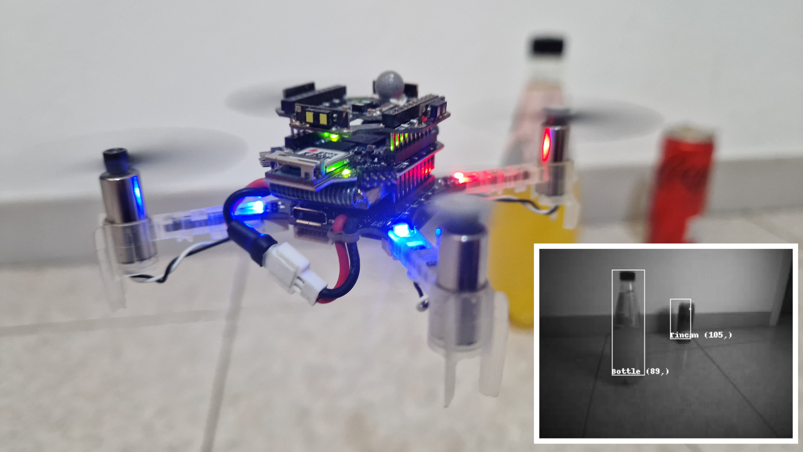

<div align="center"; margin: 0px; padding: 0px;">
  
  
  
  
  
</div>

<!-- Possible styles
style=social
style=for-the-badge
style=flat-square
 -->

<h1 align="center">PULP-Detector</h1>

<p align="center"><b>Lorenzo Lamberti, Luca Bompani, Victor Javier Kartsch, Manuele Rusci, Daniele Palossi, Luca Benini.</b></p>

<p align="center"> 
  <i> Copyright (C) 2023 University of Bologna, ETH Zürich. All rights reserved. </i> 
</p>

<div align="center" style="margin-bottom: 20px;">
  <a href="https://youtu.be/BTin8g0nyko" style="font-weight: bold;"> <strong> Video Demo </strong></a>
    ·
  <a href="https://ieeexplore.ieee.org/document/10137154" style="font-weight: bold;"><strong> IEEExplore </strong></a>
    ·
  <a href="https://arxiv.org/abs/2301.12175" style="font-weight: bold;"><strong> arXiv </strong></a>
</div>

<br>



**Video:** [YouTube](https://youtu.be/BTin8g0nyko)

**Citing:** *"Bio-inspired Autonomous Exploration Policies with CNN-based Object Detection on Nano-drones"* ([IEEExplore](https://ieeexplore.ieee.org/abstract/document/10137154), [arXiv](https://arxiv.org/abs/2301.12175))

~~~~
@INPROCEEDINGS{pulp_detector,
  author={Lamberti, Lorenzo and Bompani, Luca and Kartsch, Victor Javier and Rusci, Manuele and Palossi, Daniele and Benini, Luca},
  booktitle={2023 Design, Automation \& Test in Europe Conference \& Exhibition (DATE)},
  title={{{Bio-inspired Autonomous Exploration Policies with CNN-based Object Detection on Nano-drones}}},
  year={2023},
  volume={},
  number={},
  pages={1-6},
  doi={10.23919/DATE56975.2023.10137154}}
~~~~

## 1. Introduction
### What is PULP-Detector ?
**PULP-Detector** is a nano-drone system that strives for both maximizing the exploration of a room while performing visual object detection.
The Exploration policies as implemented as lightweight and bio-inpired state machines.
The object detection CNN is based on the MobilenetV2-SSD network.
The drone performs obstacle avoidance thanks to Time-of-flight sensors.
The drone is completely autonomous -- **no human operator, no ad-hoc external signals, and no remote laptop!**

- **Software component:**
Object detection CNN: is a shallow convolutional neural network (CNN) composed of Mobilenet-v2 backbone plus the SSD (single-shot detector) heads.
It runs at 1.6-4.3 FPS onboard.

- **Hardware components:**
The hardware soul of PULP-Detector is an ultra-low power visual navigation module embodied by a pluggable PCB (called *shield* or *deck*) for the [Crazyflie 2.0](https://www.bitcraze.io/crazyflie-2/)/[2.1](https://www.bitcraze.io/crazyflie-2-1/) nano-drone. The shield features a Parallel Ultra-Low-Power (PULP) GAP8 System-on-Chip (SoC) from GreenWaves Technologies (GWT), an ultra-low power HiMax HBM01 camera, and off-chip Flash/DRAM memory; This pluggable PCB has evolved over time, from the [*PULP-Shield*](https://ieeexplore.ieee.org/document/8715489) , the first custom-made prototype version developed at ETH Zürich, and its commercial off-the-shelf evolution, the [*AI-deck*](https://store.bitcraze.io/products/ai-deck).


Summary of characteristics:

 - **Hardware:** [*AI-deck*](https://store.bitcraze.io/products/ai-deck)

- **Deep learning framework:** Tensorflow 1.15 ([Tensorflow Object detection API](??))

- **Quantization**: fixed-point 8 bits, fully automated with [NNTool](https://greenwaves-technologies.com/sdk-manuals/nn_quick_start_guide/)

- **Deployment**: fully automated with [AutoTiler](https://greenwaves-technologies.com/sdk-manuals/nn_quick_start_guide/)

We release here, as open source, all our code, hardware designs, datasets, and trained networks.

## Setup

Clone recursively to download all submodules

```
git clone git@github.com:pulp-platform/pulp-detector.git --recursive
```


## PULP-Platforms refs

[PULP Platform Youtube](https://www.youtube.com/c/PULPPlatform) channel (subscribe it!)

[PULP Platform Website](https://pulp-platform.org/).


## Licenses

All files under:
  * `./crazyflie_app/random-following-spiral`
  * `./crazyflie_app/rotate`
  * `./gap8_app/SSD_tin_can_bottle.c`

are original and licensed under Apache-2.0, see [LICENSE.Apache.md](LICENSE.Apache.md).


The images used for the training and testing need to be downloaded and copied into the following folder:
  * `dataset/`

all the files can be downloaded from this [link](https://zenodo.org/record/8421461) and are under the Creative Commons Attribution Non Commercial No Derivatives 4.0 International see [LICENSE.CC.md](LICENSE.CC.md)


All files under:
  * `./training/`

Are from [Tensorflow](https://github.com/tensorflow/models/), released under  Apache-2.0 License, see [LICENSE.Apache.md](LICENSE.Apache.md).


All files under:
  * `./gap8_app/` (except for `./gap8_app/SSD_tin_can_bottle.c`)

Are from [GreenWaves Technologies](https://github.com/GreenWaves-Technologies), released under a BSD License, see [LICENSE.BSD.md](LICENSE.BSD.md)


The external modules under:
  * `./viewer-pulp-detector/`
  * `./crazyflie_app/crazyflie-firmware`
  * `./crazyflie_app/crazyflie-firmware-modified`

Are from [Bitcraze](https://github.com/bitcraze), released under a GPL-3.0 license.


