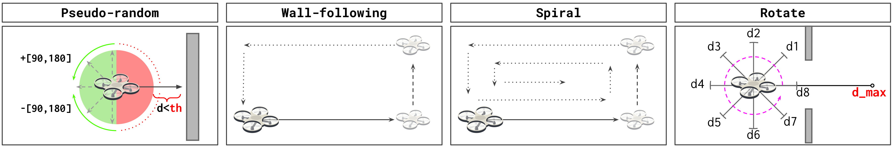

# Exploration Policies

Here you can find the code running on the STM32 of the Crazyflie 2.1.

The crazyflie application runs one of the four exploration policies described in the paper



## Instructions

To flash the stm32

Select the exploration policy 

```
cd random-following-spiral/
or
cd rotate/
```

flash the code on the STM32


```
make clean all cload
```

Then you are ready to take off!

* open the CF client `cfclient`
* go to the parameters window
* set the parameter `START_STOP.fly` to 1

The drone will now start exploring the room !


## Setup

