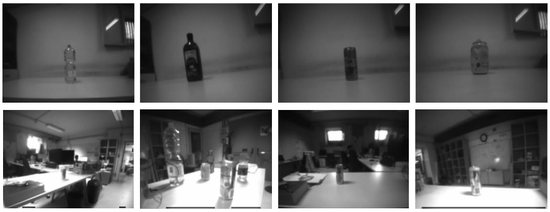

# Himax dataset

The Himax dataset has been collected at University of Bologna using a Himax ultra-low power, gray-scale, and QVGA camera.

The dataset has been used for training and testing the inference capability of our pulp-detector, an object detection CNN that detects bottles and tin cans.
This release includes the training and testing set described in the paper: https://ieeexplore.ieee.org/abstract/document/10137154.

It is composed of 321 training images and 279 testing .jpg images with resolution 324x244, each labeled with the class type and a bounding box around the bottles and tin cans.

Each folder contains a variable number of gray-scale .jpg images, ordered by number (e.g., frame_1.jpg, frame_2.jpg, etc.) and one frame_1.jxml file with all the ground-truth labels.

We provide also the TF Record files needed for the Tensorflow training: `mytestset_test.record`, `finetuning-2-train.record`.

All the files in this dataset can be downloaded from this [link](https://zenodo.org/record/8421461).

## License
We release this dataset as open source under Creative Commons Attribution Non Commercial No Derivatives 4.0 International, see [license](../Licence.CC.md)
